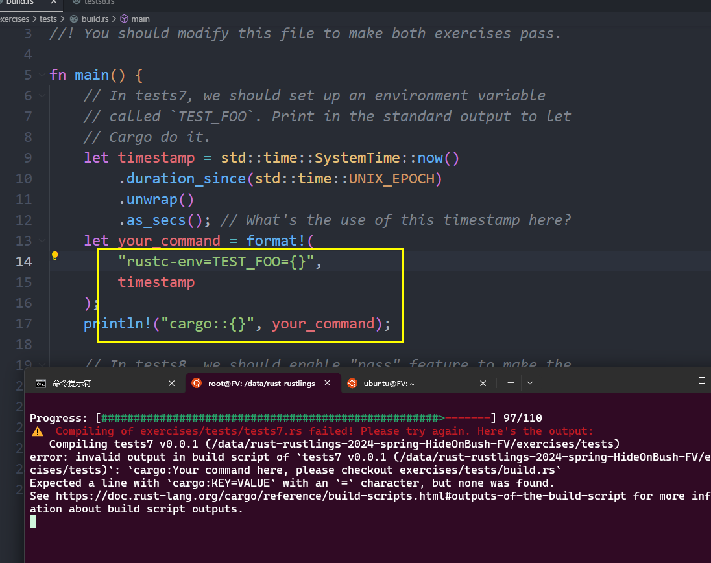

# 今日完成
## rustlings 第 97 题

无论是按照报错信息修改的

```rs
    let your_command = format!(
        "TEST_FOO={}",
        timestamp
    );
    println!("cargo:{}", your_command);
```
还是按照文档里 https://doc.rust-lang.org/cargo/reference/build-scripts.html#outputs-of-the-build-script 
全都报下面这个错


```

> 被下面 test8 影响了，出问题的时候不能只看到修改的一句，要整体都检查一遍