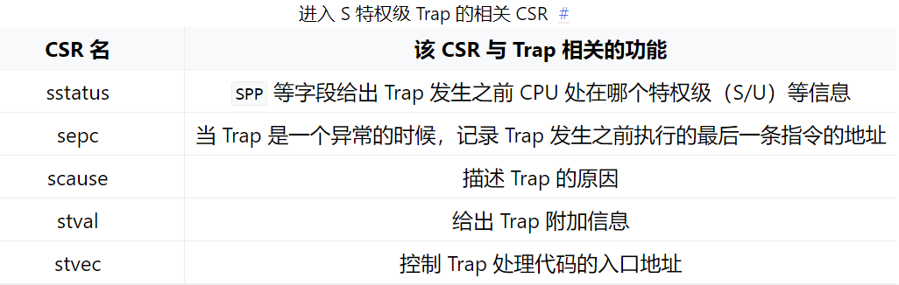

# 批处理系统
## 将应用程序链接到内核
### 静态绑定 
cargo build 构建OS时由 `os/build.rs` 自动生成的 `os/src/link_app.S` 里面，使用

```
_num_app: // 标示user程序数量和每个user程序的起始地址
app_n:
    .incbin "path/to/.bin"
```
### 动态加载

`core::slice::from_raw_parts_mut()` ：获取地址
- 获取 APP_BASE_ADDRESS , `.fill(0)` 清空
- 获取 app_start 作为 app_src、 APP_BASE_ADDRESS 作为 app_dst

`app_dst.copy_from_slice`：把user应用二进制镜像的位置复制到可以执行代码的内存区域（app_dst）

`fence.i` ：CPU 对物理内存所做的缓存又分成 **数据缓存 (d-cache)** 和 **指令缓存 (i-cache)** 两部分，分别在 CPU 访存和取指的时候使用。在取指的时候，对于一个指令地址， CPU 会先去 i-cache 里面看一下它是否在某个已缓存的缓存行内，如果在的话它就会直接从高速缓存中拿到指令而不是通过总线访问内存。通常情况下， CPU 会认为程序的代码段不会发生变化，因此 i-cache 是一种只读缓存。但在这里，OS 将修改会被 CPU 取指的内存区域，这会使得 i-cache 中含有与内存中不一致的内容。因此， OS 在这里必须使用取指屏障指令 fence.i ，它的功能是保证 在它之后的取指过程必须能够看到在它之前的所有对于取指内存区域的修改 ，这样才能保证 CPU 访问的应用代码是最新的而不是 i-cache 中过时的内容。至于硬件是如何实现 fence.i 这条指令的，这一点每个硬件的具体实现方式都可能不同，比如直接清空 i-cache 中所有内容或者标记其中某些内容不合法等等。

### 相关 Rust 语法
- RefCell：变量自身不可变或仅在不可变借用的情况下仍能修改绑定到变量上的值，无需被声明为`mut`
- UPSafeCell：允许我们在 **单核** 上安全使用可变全局变量（标记为 Sync 使得它可以作为一个全局变量）

UPSafeCell 对于 RefCell 简单进行封装，它和 RefCell 一样提供内部可变性和运行时借用检查，只是更加严格：调用 exclusive_access 可以得到它包裹的数据的独占访问权。因此当我们要访问数据时（无论读还是写），需要首先调用 exclusive_access （.borrow_mut()）获得数据的可变借用标记，通过它可以完成数据的读写，在操作完成之后我们需要销毁这个标记，此后才能开始对该数据的下一次访问。相比 RefCell 它不再允许多个读操作同时存在。

- lazy_static!：外部库引入依赖，编译期不需要设置初始值，第一次被用到才会进行实际的初始化

## 特权级切换

只要是 Trap 到 S 特权级，操作系统就会使用 S 特权级中与 Trap 相关的 **控制状态寄存器 (CSR, Control and Status Register)** 来辅助 Trap 处理。



### 硬件控制机制
- `sstatus` 的 `SPP` 字段会被修改为 CPU 当前的特权级（U/S）。
- `sepc` 会被修改为 Trap 处理完成后默认会执行的下一条指令的地址。
- `scause/stval` 分别会被修改成这次 Trap 的原因以及相关的附加信息。
- CPU 会跳转到 `stvec` 所设置的 Trap 处理入口地址，并将当前特权级设置为 S ，然后从Trap 处理入口地址处开始执行。

而当 CPU 完成 Trap 处理准备返回的时候，需要通过一条 S 特权级的特权指令 sret 来完成，这一条指令具体完成以下功能：

- CPU 会将当前的特权级按照 sstatus 的 SPP 字段设置为 U 或者 S ；

- CPU 会跳转到 sepc 寄存器指向的那条指令，然后继续执行。